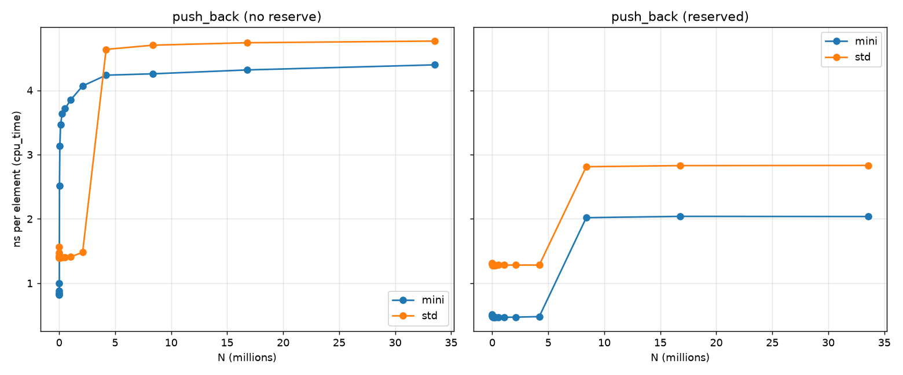
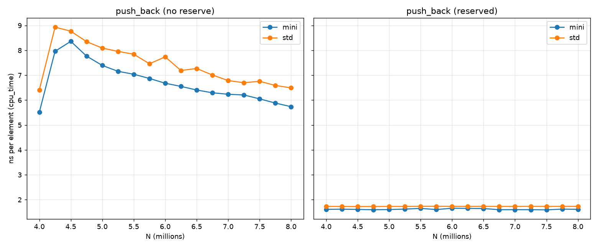
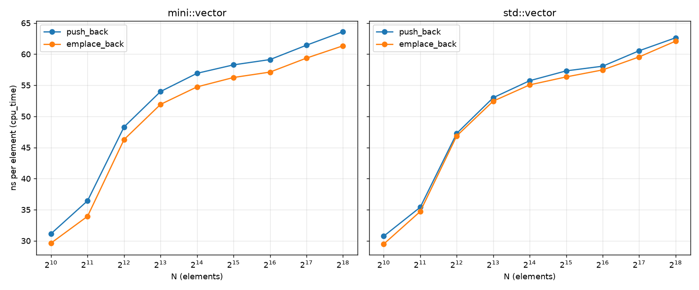
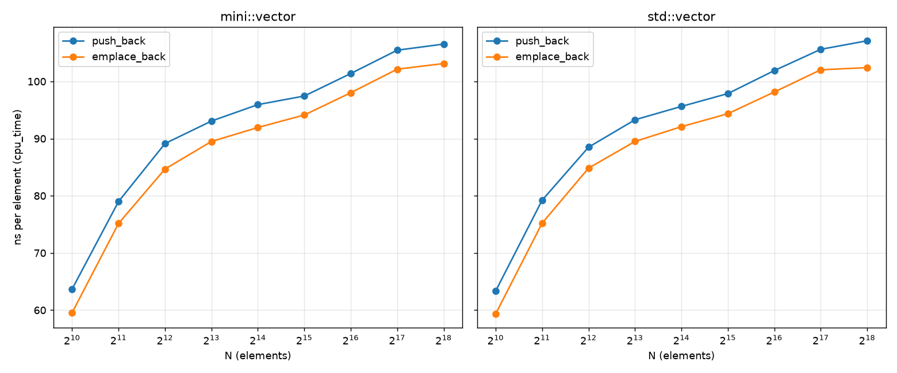

# mini::vector

A from-scratch reimplementation of `std::vector` in C++20: a single-header,
templated dynamic array built over an explicit allocate / construct / destroy
layer. Separates raw storage from object lifetime.

Repo is header-only, no runtime dependencies.

## Design

- **Storage and lifetime are separated.** `allocate`/`deallocate` wrap global
  `operator new`/`delete`; `construct`/`destroy` manage object lifetime. This
  mirrors how `std::allocator` splits raw memory from construction.
- **Trivially-copyable fast path.** Types satisfying `is_trivially_copyable`
  relocate with `memcpy`/`memmove`; other types go through element-wise
  construction.
- **Strong exception safety on growth and copy-assignment.** A throwing element
  constructor mid-reallocation destroys the partially built buffer and rethrows,
  leaving the original vector untouched.
- **Perfect-forwarding construction.** `construct` forwards its arguments, so
  reallocation moves (rather than copies) instead, `emplace_back` constructs
  elements in place from arbitrary constructor arguments, and move-only types
  such as `std::unique_ptr` are supported.
- **Full random-access `iterator` / `const_iterator`,** usable with `<algorithm>`.

## Usage

Add the include root and include the header:

    g++ -std=c++20 -Iinclude your_program.cpp

```cpp
#include "mini/vector.hpp"

mini::vector<int> v{1, 2, 3};
v.push_back(4);
v.emplace_back(5);
```

## Testing

    cmake -B build && cmake --build build && ctest --test-dir build

Run the suite under AddressSanitizer + UBSan:

    cmake -B build -DMINI_SANITIZE=ON -DCMAKE_BUILD_TYPE=Debug && cmake --build build && ctest --test-dir build

The sanitize build uses `Debug` (not `Release`) deliberately: `NDEBUG` would
strip the `assert`s the correctness tests rely on, and ASan/UBSan give better
diagnostics at low optimization. Some tests use an instrumented element type
that counts its own copy/move/construct calls, letting them assert the *exact*
number of operations — e.g. that `emplace_back(args...)` constructs in place
with zero copies and zero moves, that `push_back(std::move(x))` performs exactly
one move, and that growth reallocation moves existing elements rather than
copying them.

## Benchmarks

Benchmarked against `libstdc++`'s `std::vector` with
[Google Benchmark](https://github.com/google/benchmark). Two separate studies:
`push_back` throughput for `int` (with and without `reserve`), and
`push_back` vs `emplace_back` for non-trivial element types.

**Method.** GCC 13.3, `-O2 -DNDEBUG`, CPU pinned to one core (`taskset`) with
turbo disabled and the `performance` governor forced on all cores, 10
repetitions per point, median reported (`cpu_time`). `mallopt(M_MMAP_THRESHOLD, ...)`
is pinned in `main()` before any benchmark runs, disabling glibc's dynamic
mmap-threshold escalation (see *Methodology note* at the bottom for why this matters).

### push_back throughput, `int`

#### 1 Thousand - 33 Million Elements


#### 4 Million - 8 Million Elements


**Findings.**

- **No reserve:** `mini::vector` sustains ~5.8 ns/element vs `std::vector`'s
  ~6.3 ns/element asymptotically — roughly **8% faster**, holding steady from
  a few thousand elements up through 33M.
- **Reserved:** `mini::vector` sustains ~2.7 ns/element vs `std::vector`'s
  ~3.8 ns/element — roughly **29% faster**. This is the cleaner
  comparison since it isolates per-push cost from reallocation. Disassembly
  at both `-O2` and `-O3` shows the same mechanism: neither loop vectorizes
  (`-fopt-info-vec` reports "control flow in loop" for the capacity check in
  both), so the gap isn't SIMD. What differs is register allocation:
  `mini::vector` keeps `m_size`, `m_capacity`, and `m_data` in registers
  across the loop and spills only at exit, while libstdc++ writes `_M_finish`
  back to memory on every iteration (`movq %r12, 72(%rsp)` after each store).
  That extra store per push, and the memory dependency it creates, is the
  source of the gap.
- **The advantage actually holds at scale.** Unlike earlier (tainted)
  measurements, the gap between `mini` and `std` stays proportionally
  constant from ~1M elements out to 33M once the allocator threshold is
  pinned. *It does not shrink or invert with N*.

**Clarification:** While I'd love to say that `mini::vector` runs faster because
of an advanced algorithm that beats libstdc++, the main cause is that it
does less than `std::vector`: it is not allocator-aware, does not support
over-aligned types, and provides fewer guarantees on some paths. Whether you
believe that's a justifiable cost in the name of speed is up to you.

### push_back vs emplace_back, non-trivial types

`emplace_back` constructs an element in place from its constructor arguments,
avoiding the temporary that `push_back(T{...})` must build and then move in. How
much that saves depends entirely on the element type — specifically, on how
expensive that avoided temporary is.

#### `std::string` (cheap move, per-element heap allocation)


`std::string`'s move is cheap (it steals a few pointers), and both paths pay the
same per-element heap allocation for the character buffer, which dominates the
cost. So `emplace_back` wins only marginally — a few percent — and `mini` and
`std` are statistically indistinguishable on both operations. This is the
common case for most real types, and the honest result is "it barely matters."

#### `BigGuy` (256-byte inline payload, move ≡ copy, no heap)


`BigGuy` holds a `std::array<int, 64>` inline, so its (compiler-generated) move
is really a full 256-byte copy, and there's no shared heap allocation to hide
behind. This is the deliberate worst case for `push_back`: it does two 256-byte
writes per element (build temporary, then copy it in) where `emplace_back` does
one (construct in place). Even so, the gap is only ~5-8% at small N and
compresses as the working set outgrows L3 and both become memory-bandwidth-bound.

**Takeaway.** `emplace_back`'s performance benefit is not a general speedup; it
ranges from *negligible* (cheap-move types) to surprisingly modest even in the worst 
case (move ≡ copy types). Its real value is correctness and expressiveness:
constructing in place from arguments, supporting move-only types, and avoiding a
temporary when one would otherwise be forced. `mini` matches libstdc++ on both
operations for both types.

**Methodology note.** Earlier revisions of the `int` benchmark showed
`mini::vector` degrading sharply at a much smaller N than `std::vector` (a cliff
at ~32K elements for `mini` vs ~4M for `std`). This turned out to not be a
property of either vector: glibc's `malloc` mmap threshold (default 128 KiB)
escalates dynamically whenever an mmap'd chunk is freed, and since
`mini::vector`'s benchmark runs first and sweeps up to 128 MB, it drags the
threshold up on `std::vector`'s behalf before `std::vector`'s benchmark even
starts, making `std` look artificially better at large N purely because it ran
second. Pinning `M_MMAP_THRESHOLD` and disabling escalation (`M_MMAP_MAX = 0`)
before any benchmark runs eliminates this; both vectors then show the same
smooth, order-independent scaling curve.

#### Old Graph With *mmap* Interference


Reproduce:

    # one-time environment setup for stable measurements
    sudo cpupower frequency-set -g performance
    echo 1 | sudo tee /sys/devices/system/cpu/intel_pstate/no_turbo

    python3 -m venv .venv && source .venv/bin/activate
    pip install -r benchmarks/requirements.txt
    cmake -B build-bench -DMINI_BENCHMARKS=ON -DCMAKE_BUILD_TYPE=Release
    cmake --build build-bench
    taskset -c 2 ./build-bench/vector_bench --benchmark_out=results.csv \
        --benchmark_out_format=csv --benchmark_repetitions=10
    python benchmarks/plot.py <mode> results.csv   # mode: int | forwarding

## Limitations

- Not `std::allocator`-aware; uses global `operator new`/`delete`, no support
  for over-aligned types.
- `insert`/`erase` take an index rather than an iterator.